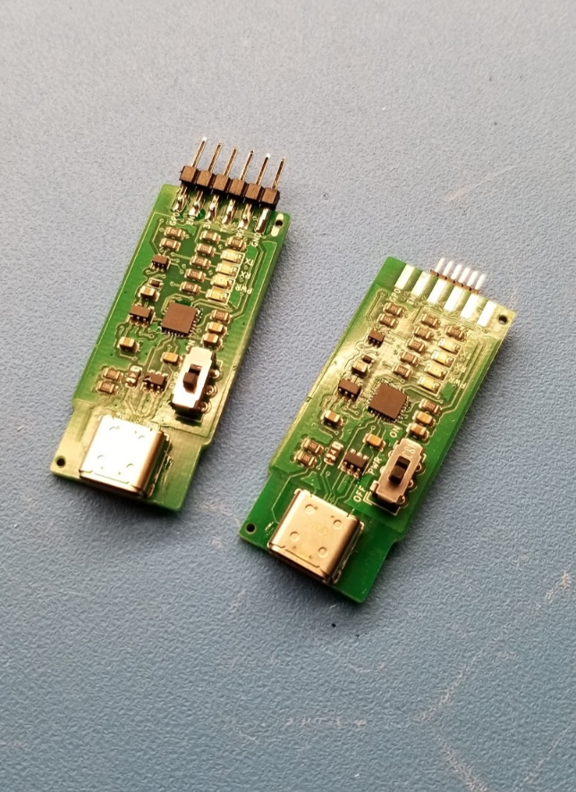
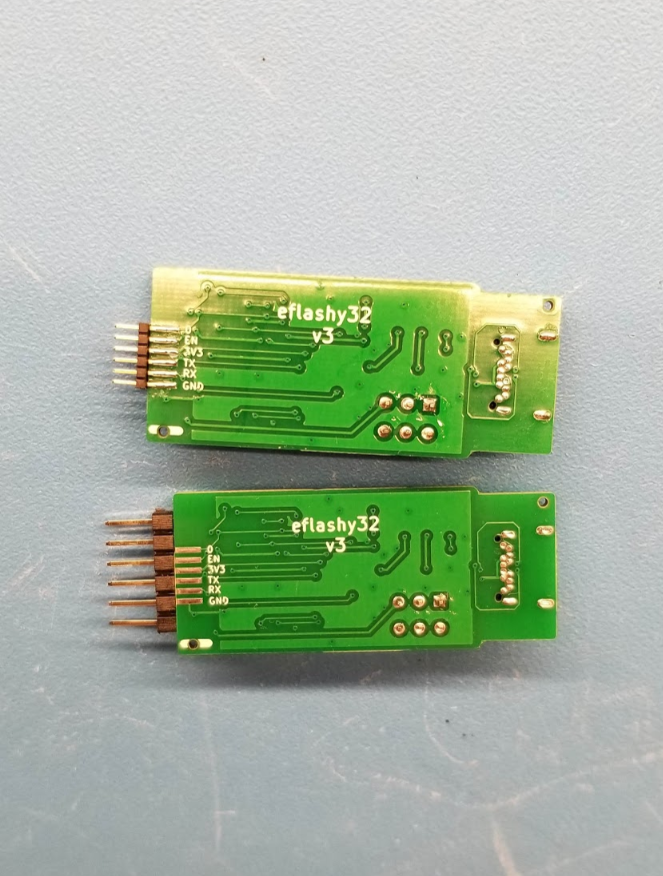

# eflashy32
USB Type-C, CP2102N serial interface targeting ESP devices. 500mA resettable fuse, ESD protection.

## Design Goals
- [ ] USB Type C
- [ ] Good serial chip with no drivers needed and no <a href="https://hackaday.com/2016/02/01/ftdi-drivers-break-fake-chips-again/">malware</a>
- [ ] Switch to toggle providing power to device
- [ ] Small
- [ ] Ability to use pogo pins

## Notes
I added the ubiquitous 2.54mm pitch header for classic scenarios, using either a 6 pin header, or using 6 pogo pins. On the back side is a similar 1.27mm pitch header for miniature designs.