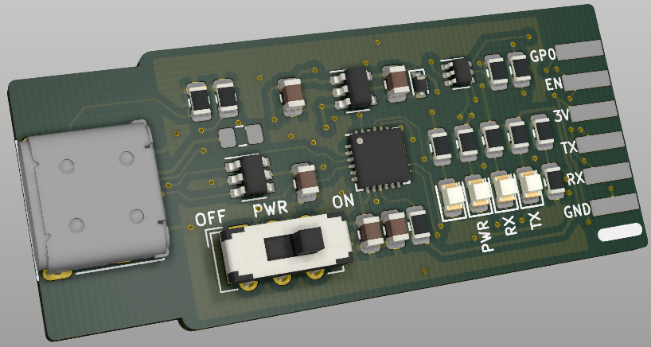

# eflashy32

eflashy32 is a USB Type-C, CP2102N serial interface targeting ESP devices. It has a 500mA resettable fuse, ESD protection, and a switch to choose if you want to send 3.3V to the device or not.

While Micro USB is still everywhere, USB-C needs to start taking over. My new laptop has only USB-C ports, and I wanted to have one less dongle.

The board is designed in a such a manner to allow either a 2.54mm pitch 1x6 pin header, 1.27mm pitch header, or pogo pins!

## Tindie
Available <a href="https://www.tindie.com/products/gcormier/eflashy32/">for purchase on Tindie</a>.

## Design Goals
- [ ] USB Type C
- [ ] Good serial chip with no drivers needed and no <a href="https://hackaday.com/2016/02/01/ftdi-drivers-break-fake-chips-again/">malware</a>
- [ ] Switch to toggle providing power to device
- [ ] Small
- [ ] Ability to use pogo pins

## Notes
I added the ubiquitous 2.54mm pitch header for classic scenarios, using either a 6 pin header, or using 6 pogo pins. On the back side is a similar 1.27mm pitch header for miniature designs.